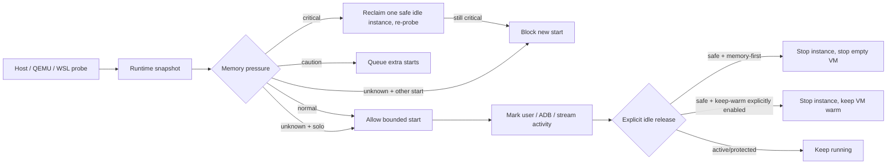
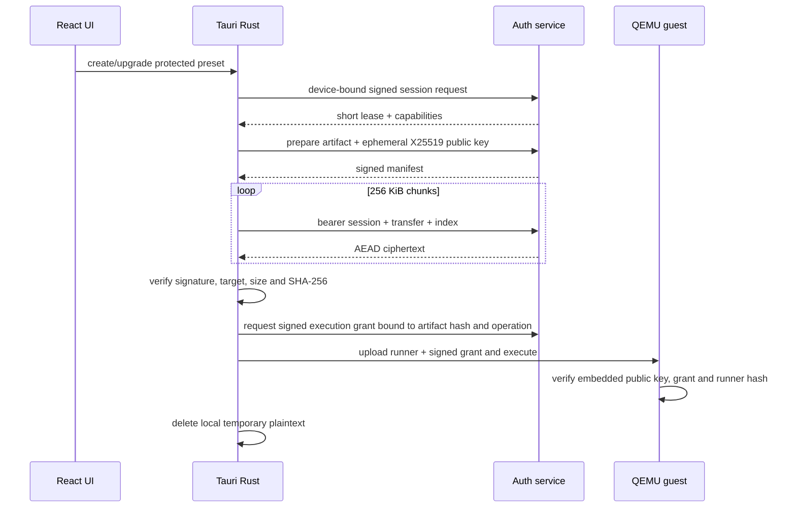

# 运行时内存优化与服务端权威核心交付报告

**日期**：2026-09-17  
**范围**：QEMU/WHPX 节点、guest 内 redroid 实例、Tauri 桌面客户端、私有授权服务  
**状态**：代码与离线协议测试已落地；部署配置、真机回归和性能矩阵仍需人工确认

## 结论

本轮已经把“加到 6–8GB”改成可测量、可回滚的运行时策略，并把受保护的 QEMU 核心路径改为服务端权威授权：

- 新建 QEMU 节点默认 **3072 MiB**；当前已有 `node1` 的 **4096 MiB 未被自动修改**，避免在线改写和数据风险。
- 增加主机、QEMU、WSL、guest/container 的只读资源采样、`lean/standard/full` 实例档案、串行启动、内存压力阻止和显式空闲释放。
- 临界压力启动现在会先尝试回收同节点内一个满足全部安全条件的闲置运行实例，再重新探测；
  节点保持温热，目标/保护/退出/未知状态实例不会被自动停止。lean 档在 3 GiB 及以上节点的
  默认容器上限与已验证起点对齐为 1536 MiB，避免给出 1152 MiB 的高风险默认值。
- 资源探针不可用时保持 `unknown`：允许一次明确的单实例启动，但阻止已有启动/排队任务时的新增并发请求，避免缺失指标成为并发启动逃生口。
- 增加默认手动的应用级暂停：只暂停经过包名与 QEMU ADB 映射校验的目标应用，保留 VM/container 温热，失败时返回原因而不执行 guest 停止动作。
- 闲置释放的缺省策略改为内存优先：新安装或缺失 `runtimeKeepVmWarm` 的配置默认停止已证明为空的
  QEMU 节点；显式开启温热选项的用户仍可保留更快的再次打开速度。该策略不会跳过共享节点的
  新鲜只读实例列表和 unknown fail-closed 护栏。
- 对已有显式温热配置增加 critical 压力覆盖：normal/caution/unknown 仍保持用户选择，只有主机
  进入 critical 且节点为空时才自动释放，避免历史配置在临界内存下继续占用 QEMU 基座。
- ART 优化变成可记录的 `verify-only / speed-profile / reset` 实验，而不是无证据默认打开。
- 2026-09-18 对现有 full `r13` 做了三次 fresh boot/前台 XHS 采样：目标应用前 guest
  约 2.32 GiB，前台后约 2.84–3.00 GiB；QEMU private 约 4.25–4.30 GiB，宿主可用
  约 0.45–1.15 GiB。该实例的 ART speed-profile 冷启动 P50 为 2142 ms → 1544 ms，
  但尚未覆盖登录/连续浏览，证据见 E-036。
- 桌面端 QEMU 节点启动现在会读取节点 `mem_mib`，在 QEMU 进程创建前检查主机可用内存与 1 GiB 余量，并串行化启动预检查，避免第二个大节点把主机直接推入临界压力。
- 独立 `qemu-center vm start` 也执行同一内存阈值的防御性检查，并在 QMP 状态 unknown 时拒绝启动；Windows 通过 CIM 读取可用物理内存，Linux 读取 `MemAvailable`，防止 CLI 绕过桌面端护栏。
- QEMU 预装/创建路径在 Rust 后端取得有效短期租约和服务端下发的核心脚本后才执行；发布构建不再嵌入本地 `qemu_guest.py`。
- 核心下载后还要取得独立的 per-operation execution grant；服务端按发布文件哈希签发，Rust 和 guest runner 均校验工作流、VM、实例、版本与短时有效期，激活阶段先由 guest 在线消费 JTI，再允许宿主侧 Docker 创建；生产 artifact 必须由 `artifact publish-runner` 嵌入公钥和 HTTPS consume URL 后发布。
- 桌面端 QEMU 创建入口已强制使用上述受保护路径；独立 `qemu-center redroid create` 现在还必须验证发布时嵌入公钥环校验的服务端签名 grant，以及同一 guest 作业目录内由 runner 写入的一次性在线预授权证明，才触碰 Docker。`qemu-center` 仍是内部编排 CLI，不应作为独立用户客户端分发；guest 设备证明与服务端 JTI 一次性消费仍是最终授权边界。它不含核心脚本，但高价值逻辑仍必须继续留在服务端/受保护 artifact 中。
- guest 在线预授权证明已收紧为服务端签名 authorization receipt，而不是可被 guest 内写权限伪造的纯 JTI 文件：`qemu-center` 在任何 Docker 操作前读取回执、用发布时嵌入的公钥环验签，并比对 grant 的设备、会话、版本、artifact 哈希、动作、VM、实例和 JTI；纯 JTI、签名篡改、过期或错绑回执均 fail closed，见 E-065。
- 在 receipt 验签之后、任何 Docker 命令之前，`qemu-center` 还以 `create_new` 原子写入同一 host state directory 的一次性消费账本；同一 JTI 的重复/并发消费 fail closed，见 E-066。它是同主机纵深防御，不替代服务端设备 proof，也不能阻止管理员复制或删除整个状态目录。
- 已完成无生产密钥的签名轮换代码演练：跨服务重启的旧/新 execution grant 与 authorization receipt 分别绑定 `auth-old`/`auth-next`，旧 grant 重放、旧 authority 验证新 receipt 和旧 grant 在重启后消费均拒绝；runner 两代渲染不串 key，四个 release 产物核心扫描 clean，Windows release workflow 已将该演练设为发布门禁，见 E-067。生产 TLS、secret manager、真实账号、跨设备和 live guest 仍是人工门禁。
- 核心文件以签名 manifest + X25519/HKDF + ChaCha20-Poly1305 的 **256 KiB 加密分块**交付，服务端每个分块重新校验会话、设备绑定、权限和撤销状态。
- 执行 grant 还要求客户端使用 DPAPI 保护的设备私钥对精确 payload 生成 `device_proof`，guest 和服务端均 fail closed；复制 artifact、改名或复制 grant 不能替代另一台设备的私钥，见 E-050。
- 客户端首次验证租约时同时考虑本机时间与服务端时间，接受后以进程单调时钟跟踪到期，避免旧响应时间或本机时钟回拨延长会话。
- 受保护下载路径会把共享运行时状态中已验证的 session 传给实际下载客户端，避免客户端重建后丢失授权上下文。
- 受保护 runner 上传到 guest 后统一暂存于 `/run/rdc-presets/<job>`，由首启/恢复置备创建为
  `rdc:rdc`、`0700`；这会把异常退出后的核心明文残留从持久化 home 卷移到 guest RAM，
  VM 重启后自然消失，同时保留每次操作结束的显式清理。它不是安全擦除，运行期间的 guest
  root、管理员或调试器仍可能读取明文，见 E-053。
- Windows 新安装的授权身份优先使用 Platform Crypto Provider 的不可导出 ECDSA P-256
  named key；客户端只登记 SEC1 公钥，既有 DPAPI/Ed25519 身份保持兼容。状态接口与 Settings
  展示 `hardware_backed`、`cng_software_provider` 或 `dpapi_software_fallback`，严格模式由
  `RDC_REQUIRE_HARDWARE_BACKED_KEYS=1` 开启；当前 provider 无法报告 implementation type
  时只按软件 CNG 处理，TPM/VBS 仍需人工确认，见 E-054。
- Windows 本机 local PTY 已修复：继承的 Unix `TERM=dumb` 不再传给 PowerShell/ConPTY，避免
  VT 初始化导致的测试卡住；设备 ADB shell 路径不受影响。最终自动化门禁为 Tauri 299 通过、0
  失败、2 忽略；本轮 Tauri NSIS release 安装包已生成，桌面主程序、DLL、MCP 与 qemu-center
  核心明文扫描均为 `clean`，见 E-056、E-065。

这不是“绝对反逆向”。核心脚本必须在 guest 中运行，因此拥有管理员、调试器或 guest root 的攻击者仍可能在本次合法运行期间提取明文。真正高价值的判定和算法应继续放在服务端。

## E/F/P 证据链

| ID | 类型 | 内容 | 路径 |
|---|---|---|---|
| E-001 | Evidence | 当前主机/QEMU/WSL 与实例状态基线 | `work/runtime-core-protection-20260917/evidence/E-001-runtime-baseline.md` |
| E-002 | Evidence | 加密分块、manifest 绑定和服务端撤销测试 | `work/runtime-core-protection-20260917/evidence/E-002-authorized-chunks.md` |
| E-003 | Evidence | Rust 闸门、发布构建无本地核心回退、DPAPI 身份存储 | `work/runtime-core-protection-20260917/evidence/E-003-client-gate.md` |
| E-004 | Evidence | 自动化验证命令与结果 | `work/runtime-core-protection-20260917/evidence/E-004-validation.md` |
| E-005 | Evidence | Android 目标应用与可选组件的进程级内存构成 | `work/runtime-core-protection-20260917/evidence/E-005-app-process-breakdown.md` |
| E-010 | Evidence | 未知资源压力下的单实例/批量启动护栏 | `work/runtime-core-protection-20260917/evidence/E-010-unknown-pressure-start-guard.md` |
| E-011 | Evidence | 新节点 Docker 组刷新窗口与 root recovery 置备 | `work/runtime-core-protection-20260917/evidence/E-011-guest-bootstrap-permission-window.md` |
| E-012 | Evidence | 首启修复后的全项目自动化复验 | `work/runtime-core-protection-20260917/evidence/E-012-validation-after-bootstrap-fix.md` |
| E-013 | Evidence | 删除运行态护栏与节点密钥清理 | `work/runtime-core-protection-20260917/evidence/E-013-delete-safety-and-key-cleanup.md` |
| E-014 | Evidence | 删除护栏后的最终全项目自动化复验 | `work/runtime-core-protection-20260917/evidence/E-014-final-validation-after-delete-guard.md` |
| E-015 | Evidence | guest readiness 等待与临时节点安全清理 | `work/runtime-core-protection-20260917/evidence/E-015-guest-readiness-and-safe-purge.md` |
| E-016 | Evidence | 3072 MiB lean/XHS 冷启动与 ART 对照 | `work/runtime-core-protection-20260917/evidence/E-016-xhs-lean-art-matrix.md` |
| E-017 | Evidence | ART/PID 修复后的最终测试、release 构建与核心扫描 | `work/runtime-core-protection-20260917/evidence/E-017-final-validation-after-art-and-pid-fixes.md` |
| E-018 | Evidence | 租约时钟加固后的全套自动化复验 | `work/runtime-core-protection-20260917/evidence/E-018-lease-clock-hardening-validation.md` |
| E-019 | Evidence | 受保护下载 session 交接修复与复验 | `work/runtime-core-protection-20260917/evidence/E-019-protected-download-session-handoff.md` |
| E-020 | Evidence | session 交接修复后的最终门禁与发布复验 | `work/runtime-core-protection-20260917/evidence/E-020-final-validation-after-session-handoff.md` |
| E-021 | Evidence | 临界压力自动回收与 lean profile floor 修复 | `work/runtime-core-protection-20260917/evidence/E-021-critical-pressure-reclaim-and-profile-floor.md` |
| E-022 | Evidence | 创建预算只计入已确认运行中的容器 | `work/runtime-core-protection-20260917/evidence/E-022-running-budget-count.md` |
| E-026 | Evidence | 授权服务敏感响应禁止缓存与 transfer 容量护栏 | `work/runtime-core-protection-20260917/evidence/E-026-authorization-service-hardening.md` |
| E-027 | Evidence | 授权服务仅接受回环明文监听 | `work/runtime-core-protection-20260917/evidence/E-027-loopback-bind-guard.md` |
| E-028 | Evidence | QEMU 节点启动按请求内存和主机余量预检查 | `work/runtime-core-protection-20260917/evidence/E-028-vm-start-memory-guard.md` |
| E-029 | Evidence | 独立 qemu-center CLI 启动内存与 QMP 护栏 | `work/runtime-core-protection-20260917/evidence/E-029-cli-vm-start-memory-guard.md` |
| E-030 | Evidence | 授权服务控制面请求体 64 KiB 护栏 | `work/runtime-core-protection-20260917/evidence/E-030-authorization-control-plane-body-limit.md` |
| E-031 | Evidence | 注册、审批、租约与加密 artifact 路由链 | `work/runtime-core-protection-20260917/evidence/E-031-registration-and-artifact-protocol.md` |
| E-032 | Evidence | release 二进制未嵌入核心脚本正文 | `work/runtime-core-protection-20260917/evidence/E-032-release-core-body-scan.md` |
| E-033 | Evidence | node1/full r13 实时内存快照 | `work/runtime-core-protection-20260917/evidence/E-033-live-node-memory-snapshot-20260918.md` |
| E-034 | Evidence | full profile 新建节点内存护栏 | `work/runtime-core-protection-20260917/evidence/E-034-full-profile-admission-guard.md` |
| E-035 | Evidence | per-operation execution grant、guest 验签与 runner 发布渲染 | `work/runtime-core-protection-20260917/evidence/E-035-execution-grant-boundary-20260918.md` |
| E-036 | Evidence | 4096 MiB/full r13 实时内存与 ART 对照 | `work/runtime-core-protection-20260917/evidence/E-036-live-memory-and-art-20260918.md` |
| E-037 | Evidence | 应用暂停与停止实例的实时内存对照 | `work/runtime-core-protection-20260917/evidence/E-037-live-app-pause-sample-20260918.md` |
| E-050 | Evidence | 设备绑定执行证明与跨设备复制拒绝 | `work/runtime-core-protection-20260917/evidence/E-050-device-bound-execution-proof-20260918.md` |
| E-052 | Evidence | 受保护核心临时明文残留清理 | `work/runtime-core-protection-20260917/evidence/E-052-protected-core-temp-cleanup-20260918.md` |
| E-053 | Evidence | guest 侧受保护核心 RAM 暂存、全门禁与 release 扫描 | `work/runtime-core-protection-20260917/evidence/E-053-guest-core-ram-staging-20260920.md` |
| E-054 | Evidence | Windows CNG 设备签名密钥、策略级别、Settings 展示与 provider 探针 | `work/runtime-core-protection-20260917/evidence/E-054-device-signing-key-hardening-20260920.md` |
| E-055 | Evidence | Release/Debug 核心边界、授权链路与反逆向源码审计 | `work/runtime-core-protection-20260917/evidence/E-055-anti-reverse-source-audit-20260920.md` |
| E-056 | Evidence | Windows PTY 环境修复后的最终全套门禁、Release 构建与核心扫描 | `work/runtime-core-protection-20260917/evidence/E-056-final-verification-and-pty-fix-20260920.md` |
| E-057 | Evidence | 客户端旧/新公钥信任环轮换聚焦测试 | `work/runtime-core-protection-20260917/evidence/E-057-public-key-ring-rotation-test-20260920.md` |
| E-058 | Evidence | QMP 超时主机进程安全兜底与隔离克隆 | `work/runtime-core-protection-20260917/evidence/E-058-qmp-timeout-host-process-proof-20260920.md` |
| E-059 | Evidence | 2048 MiB QEMU 基座样本与克隆 SSH 身份修复 | `work/runtime-core-protection-20260917/evidence/E-059-2048mib-qemu-base-sample-20260920.md` |
| E-060 | Evidence | 2048 MiB 节点真实 Redroid lean 启动样本 | `work/runtime-core-protection-20260917/evidence/E-060-2048mib-redroid-lean-boot-20260920.md` |
| E-062 | Evidence | qemu-center 创建命令的签名 grant 闸门与发布资源接线 | `work/runtime-core-protection-20260917/evidence/E-062-qemu-cli-capability-gate-20260920.md` |
| E-063 | Evidence | 创建前 guest 在线预授权、证明绑定与 Docker 前 fail-closed | `work/runtime-core-protection-20260917/evidence/E-063-activation-authorization-preflight-20260920.md` |
| E-064 | Evidence | 宿主机余量不足时在 QEMU 创建前拒绝启动 | `work/runtime-core-protection-20260917/evidence/E-064-host-memory-preflight-20260920.md` |
| E-065 | Evidence | 服务端签名 authorization receipt 与节点侧 Docker 前验签闸门 | `work/runtime-core-protection-20260917/evidence/E-065-signed-authorization-receipt-20260920.md` |
| E-066 | Evidence | 宿主侧 authorization receipt 一次性重放闸门 | `work/runtime-core-protection-20260917/evidence/E-066-host-receipt-replay-guard-20260920.md` |
| E-067 | Evidence | 无生产密钥的服务端签名轮换代码演练与发布扫描 | `work/runtime-core-protection-20260917/evidence/E-067-auth-key-rotation-rehearsal-20260920.md` |
| F-001 | Finding | QEMU 提交空间、物理工作集、WSL 和宿主压力不是同一个指标 | 本报告“内存结论” |
| F-002 | Finding | 旧节点不能安全在线缩容；新节点默认和实例档案已下调 | 本报告“内存策略” |
| F-003 | Finding | 前端判断不能作为授权边界，Rust 命令必须在执行前取租约 | 本报告“授权路径” |
| F-004 | Finding | 本地执行不可避免地留下运行时明文 | 本报告“残余风险” |
| F-005 | Finding | 实例级启动调度不能覆盖 QEMU VM 的 `-m` 提交成本 | E-028 与本报告“内存结论” |
| F-006 | Finding | 仅在桌面端检查内存会留下 CLI 绕过路径 | E-029 与本报告“资源路径” |
| F-007 | Finding | 授权控制面缺少请求体上限会放大异常请求的内存压力 | E-030 与本报告“授权路径” |
| F-008 | Finding | 当前 full r13 在 4 GiB 节点上接近 3 GiB cgroup 上限并压低主机可用内存 | E-033 与本报告“内存结论” |
| P-001 | Path | UI → Tauri Rust → authorization service → encrypted artifact → QEMU guest | 本报告“授权路径” |
| P-002 | Path | snapshot → pressure classifier → scheduler → explicit idle release | 本报告“资源路径” |
| P-003 | Path | QEMU instance row → package/mapping/idle checks → app-only force-stop | 本报告“资源路径” |

## 内存结论

当前只读基线显示：主机总内存约 15.7 GiB、可用约 3.69 GiB；现有 QEMU `-m 4096 -smp 4` 的进程专用内存约 4.66 GB、工作集约 0.58 GiB，`vmmemWSL` 专用内存约 1.71 GB。`r1` 曾出现 `Exited (137)`，说明容器压力不能只靠把上限改成 1 GiB 来解决。

对仍在运行的 `qc-r13` 做了多次只读 guest 采样：早期约 **2.514 GiB / 3 GiB（83.81%）**，随后产品 CLI 的最新采样约 **2.88 GiB / 3 GiB（约 96%）**，峰值约 3 GiB，`oom_kill=0`。这证明 full 档案的 3 GiB 上限已经接近实际需求；在完成精简组件 A/B 前，不应继续下压到 1–2 GiB。

2026-09-18 对安全启动后的真实 `node1/full r13` 快照进一步采样到 **3208708096 bytes ≈ 3060.1 MiB / 3072 MiB（99.6%）**，`oom_kills=0`；同一时刻主机可用约 **0.356 GiB**，QEMU working set 约 **2.955 GiB**、private memory 约 **4.283 GiB**。这解释了当前“整体像占用 6–8GB”的体感：guest cgroup、QEMU 工作集/私有提交和主机余量是不同层级，且该 full 实例已经把 4 GiB 节点推入临界压力区。详见 E-033；这仍是瞬时采样，不替代登录、连续浏览和稳定性矩阵。

因此，新的 `full` profile 在节点配置低于 **6144 MiB** 时被 qemu-center 拒绝，桌面创建表单同步禁用该选项；该护栏只阻止新的高风险组合，不会在线缩容或停止已有 full 实例。lean/standard 的 4 GiB 映射保持不变，验证见 E-034。

后续隔离实验补充了两个更低内存层级：3072 MiB / 2 vCPU 的 lean 与 standard 已分别取得
真实小红书冷启动样本（E-042、E-043）；全新 2048 MiB / 2 vCPU Ubuntu/Docker 基座在
cloud-init/Docker readiness 完成后 QEMU working set 约 **1.89 GiB**、guest available
约 **1.54 GiB**，但尚未安装小红书或执行登录/连续浏览。2048 MiB 因此只能作为下一轮
业务验收候选，不能直接替代 3072 MiB standard 推荐；克隆 SSH 身份修复与安全清理见 E-059。

进一步的进程级采样显示：`com.xingin.xhs` 有 13 个进程，RSS 合计约 3.80 GiB（共享页会重复计算）；GApps、Play、Quick Search 与 `lspd` 筛选出的 8 个进程 RSS 合计约 1.04 GiB。该结果支持优先验证无 GApps/Magisk 的 lean 档，以及保留 VM/container 但在闲置时暂停目标应用进程；它不支持直接削减 full 容器硬上限。

因此，页面现在分别展示 host available、QEMU private/working-set、WSL private、实例当前/峰值/限制/OOM，而不是把它们相加后冒充一个“实际占用”。此前 CLI 因 Docker 短 ID 与完整 ID 未合并而返回空值，现已修复并现场读到 current/peak/OOM/CPU/boot；缺失数据显示为 `unknown` 或 `n/a`，不会伪造为 0。

一次隔离的 3072 MiB / 2 vCPU 节点试启动暴露了另一个边界：原有实例级调度器只保护
guest/container 启动，桌面端节点按钮仍可直接拉起第二个 QEMU 进程；实验期间主机可用
内存降到约 0.25 GiB。现在 `qemu_vm_start` 在 QEMU 创建前按节点配置内存加 1 GiB
余量做只读预检查，并以进程级锁串行化检查与启动；探针 unknown 时仍只保留明确的
单次启动兼容行为。完整实验记录见 E-028。

4 GiB 节点上的实例档案起点为：

| 档案 | 容器内存起点 | CPU 起点 | 可选组件 |
|---|---:|---:|---|
| lean | 1536 MiB | 1 | GApps/Magisk 关闭 |
| standard | 2048 MiB | 1 | 可选组件关闭 |
| full | 3072 MiB | 2 | GApps/Magisk 开启 |

这些是起点，不是“每个应用都能稳定运行”的承诺。小红书登录、浏览、上传和后台稳定性必须按验收矩阵实测；当前节点不自动缩到 3072 MiB。

在隔离的 3072 MiB / 4 vCPU lean 节点上，XHS 冷启动三次的 speed-profile
前后 P50 为 914 ms → 932 ms，未显示足够改善，因此没有把 ART 优化设为默认；
容器 current 约 1.12 GiB、OOM 为 0。该样本未覆盖登录、连续浏览和长时间稳定性，
完整记录见 `E-016-xhs-lean-art-matrix.md`。

## 资源路径 P-002

系统不会硬杀 QEMU，也不会在 VM 运行时用离线工具改 qcow2。释放由用户动作或临界压力下的明确安全策略触发；实例和桌面端 VM 启动都会受并发数和可用内存压力约束。

创建新实例时，预算优先使用 guest 的只读 Docker 状态，只把明确 `Up`/`running`
的唯一 `qc-*` 容器计入运行竞争；退出容器保留注册和数据卷但不继续占用运行预算。
guest 不可达或状态不完整时回退到注册实例数，保持保守。详见 E-022。

应用级暂停是显式用户动作，不会自动计时触发；它不停止 redroid container，也不停止 QEMU VM。实际可释放内存和唤醒耗时仍需按实验矩阵人工测量。

## 授权路径 P-001

Rust 侧验证设备身份、签名租约、能力、版本、session/manifest 绑定和完整文件哈希；React 只展示状态。新 Windows 安装的设备私钥由 CNG named key 保持不可导出，旧安装继续由 Windows DPAPI 当前用户范围保护；重新注册或撤销客户端会使旧 session 失效，版本不匹配也不能建立新 session。

授权服务 `/v1` 响应统一带 `Cache-Control: no-store` 与 `Pragma: no-cache`；临时 artifact
transfer 默认最多保留 128 个，插入前回收过期条目，达到上限返回 503，避免代理缓存
敏感响应或未完成下载无限增长进程内状态。服务启动配置还会在绑定前拒绝通配、局域网、
公网和主机名监听，只接受字面量回环地址；生产应由同机受管 TLS 1.3 边缘代理转发。

## 残余风险与上线前置条件

1. 授权服务当前是独立 crate，尚未替真实账号系统、生产 TLS 反向代理、密钥轮换服务和监控告警；服务进程已拒绝非回环明文监听，但同机 TLS 边缘、真实账号和生产密钥仍需部署演练；客户端已经支持构建期旧/新公钥信任环；服务端要求通过部署 secret manager 注入私钥、数据库和 artifact root。
2. 客户端只内置公钥，并已支持构建期旧/新公钥信任环；生产仍需完成一次双公钥窗口、服务端切换、旧客户端退出和移除旧公钥的轮换演练，不能临时把私钥放进客户端。
3. `qemu_guest.py` 的 debug 回退只用于本地开发；release 构建无此回退。发布流水线必须配置 `RDC_AUTH_BASE_URL`、`RDC_AUTH_PUBLIC_KEYS`（或兼容的单公钥变量），并使用 `rdc-auth-admin artifact publish-runner` 在服务端发布每个 Android/ABI 目标 artifact；原始 placeholder 源文件不能直接发布。
4. 授权成功后，guest 内执行的脚本仍可被 root/调试器观察；不要把最终授权判定、长期密钥或最高价值算法只放在脚本里。宿主侧 receipt 账本只能防同一状态目录的重复/并发消费，不能抵御管理员复制或删除整个状态目录。
5. Tauri 进程首次准备受保护核心前会清理上次异常退出留下的匹配临时 runner，
   但这不是安全擦除；当前性能、登录浏览、视觉和真机结果仍需要人工确认，不能由本报告替代。

## 建议的验收顺序

详见 [`2026-09-17-runtime-memory-authorization-acceptance.md`](2026-09-17-runtime-memory-authorization-acceptance.md)。先在隔离测试设备完成 3072/4096 MiB × lean/standard/full 的冷启动/热切换矩阵，再部署服务端试运行，最后验证断网、撤销、版本不匹配、篡改 manifest 和跨设备复制均拒绝。
